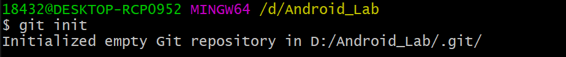
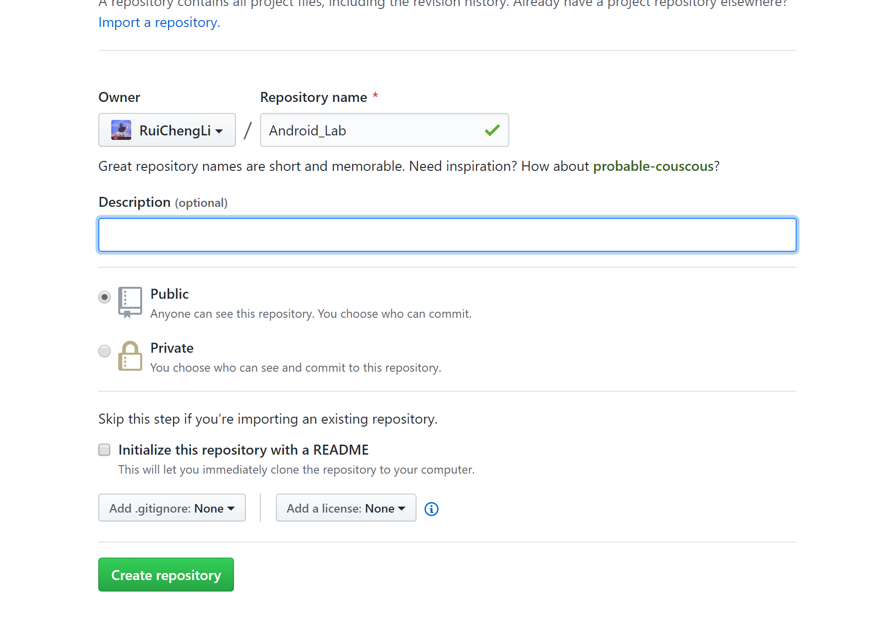
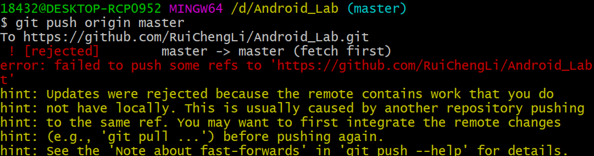

## 1.创建工程目录

首先找到你已经建立好的**目录**，比如我的Android_Lab，里面的**Hello**子目录是一个hello world工程。

###### 

hello world运行结果

###### 

然后右键Android_Lab，选择**Git Bash Here**，出现一个Git Bash命令行窗口。

## 2. Git 操作

```shell
git init 
```

建立一个本地仓库

## 

首先在刚才打开的Git Bash里面敲入命令 ：

```
vim .gitignore
```

###### 

编辑完以后按ESC，然后敲入：wq保存并退出。

###### 

这样.gitignore文件就建好了，同时就定义好了上传代码时的文件忽略规则。

接下来我们就可以放心地上传工程代码了。在Git Bash里面敲入 

```
 git add .
```

然后接着敲入命令：

```
git commit -m “commit info”
```

commit以后，代码就已经同步到git本地仓库了。但是还没有提交到远程的仓库，远程仓库就是github上你自己建立的仓库。

## 3. 接下来我们需要在Git bash里先**添加**一下远程仓库

首先要获取远程仓库的仓库地址，登录**github**，找到自己新建的那个仓库。这里为了演示，我在我的github上新建了一个Test仓库。

###### 

###### 

然后复制图中的仓库地址。这里的地址有两种形式，https方式和ssh方式，https方式可以直接复制使用仓库地址。

然后回到Git Bash，在里面敲入 

```
git remote add origin “your url”
```


验证是否成功

###### 

接着我们就要把代码上传到远程仓库了。敲入 

```
git push origin master
```

###### 

出现了问题，说是无法push到远程仓库，因为远程仓库里含有一些文件没有同步到本地仓库。这时我们需要先pull再push。具体做法是先敲入

```
git pull origin master --allow-unrelated-histories
```

###### 

```
 git push origin master
```

###### 

之后使用只需要

```
git add .

git commit -m "Android_Lab"

git push -u origin master
```

最后我们到 github 网站上查看一下上传的结果。

