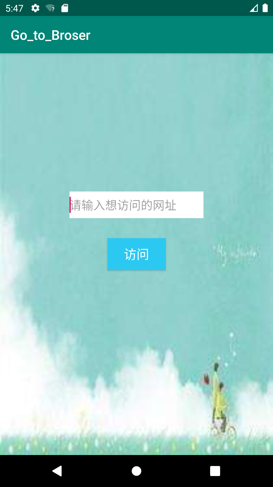
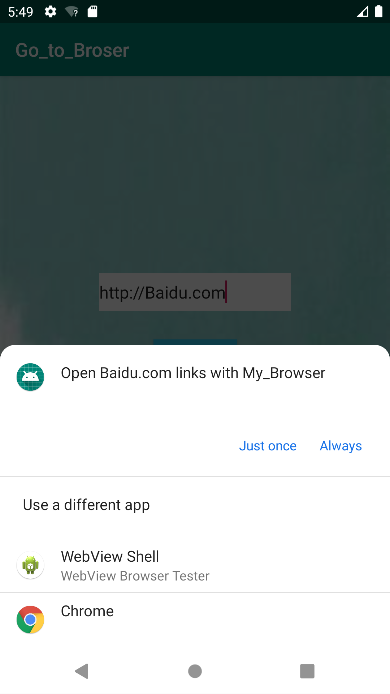
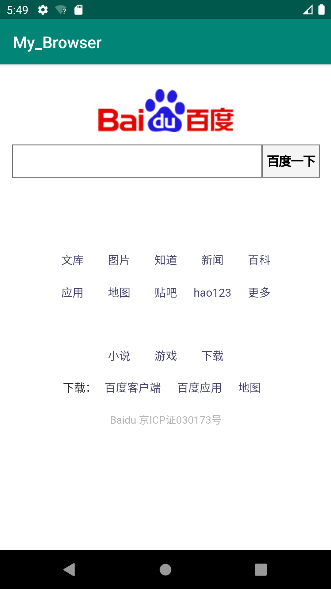

# 实验四：Intent

**1.自定义WebView验证隐式Intent的使用**

**2.新建工程获取URL地址并启动Intent**

---

**关于实验的简单介绍：**

实验含有两个工程：

1. 简易的浏览器，里面有一个webview来显示网页，满足http协议的url。

2. 一个应用，输入URL地址，点击按钮，弹出不同浏览器供选择，选择我们自己建的那个，进行网页的访问。

###### 

---

**实验步骤：**

输入URL地址，点击按钮，弹出不同浏览器供选择。

布局文件：

我这里用的是约束布局：有一个编辑文本框用来输入，一个按钮，用来实现跳转。

```xml
<?xml version="1.0" encoding="utf-8"?>
<androidx.constraintlayout.widget.ConstraintLayout xmlns:android="http://schemas.android.com/apk/res/android"
    xmlns:app="http://schemas.android.com/apk/res-auto"
    xmlns:tools="http://schemas.android.com/tools"
    android:layout_width="match_parent"
    android:layout_height="match_parent"
    tools:context=".MainActivity"
    android:background="@drawable/timg">

    <Button
        android:id="@+id/btn_browse"
        android:layout_width="wrap_content"
        android:layout_height="wrap_content"
        android:background="@color/orange_normal"
        android:useLevel="true"
        android:text="@string/btn_browse"
        android:textColor="#FFFFFF"
        android:textSize="19sp"
        app:layout_constraintBottom_toBottomOf="parent"
        app:layout_constraintLeft_toLeftOf="parent"
        app:layout_constraintRight_toRightOf="parent"
        app:layout_constraintTop_toTopOf="parent" />

    <EditText
        android:id="@+id/editText"
        android:layout_width="202dp"
        android:layout_height="40dp"
        android:layout_marginBottom="30dp"
        android:background="@color/colorWite"
        android:hint="@string/hint_edit"
        android:textSize="18sp"
        app:layout_constraintBottom_toTopOf="@+id/btn_browse"
        app:layout_constraintLeft_toLeftOf="parent"
        app:layout_constraintRight_toRightOf="parent" />

</androidx.constraintlayout.widget.ConstraintLayout>
```

布局样式：

###### 

Activity文件：

按钮响应事件，实现隐式Intent

```java
package com.example.go_to_broser;

import androidx.appcompat.app.AppCompatActivity;

import android.content.Intent;
import android.net.Uri;
import android.os.Bundle;
import android.view.View;
import android.widget.Button;
import android.widget.EditText;

public class MainActivity extends AppCompatActivity {
    EditText editText;
    Button btn_browse;

    @Override
    protected void onCreate(Bundle savedInstanceState) {
        super.onCreate(savedInstanceState);
        setContentView(R.layout.activity_main);
        editText = (EditText) findViewById(R.id.editText);
        btn_browse = (Button) findViewById(R.id.btn_browse);
        btn_browse.setOnClickListener(new View.OnClickListener() {
            @Override
            public void onClick(View view) {
                String url = editText.getText().toString();
                Intent intent = new Intent();
                intent.setAction(Intent.ACTION_VIEW);
                intent.setData(Uri.parse(url));
                startActivity(intent);
            }
        });
    }
}
```

新建一个工程：

有一个webview来显示网页，满足http协议的url。

webview：

```xml
    <WebView
        android:layout_width="match_parent"
        android:layout_height="match_parent"
        android:id="@+id/webView">
    </WebView>
```

Activity：

```java
@Override
protected void onCreate(Bundle savedInstanceState) {
    super.onCreate(savedInstanceState);
    setContentView(R.layout.activity_broser);
    Intent intent = getIntent();
    Uri data = intent.getData();
    URL url = null;

    try {
        url = new URL(data.getScheme(), data.getHost(),
                data.getPath());
    } catch (Exception e) {
        e.printStackTrace();
    }
    startBrowser(url);

}

private void startBrowser(URL url) {
    WebView webView = (WebView) findViewById(R.id.webView);
    //加载url
    webView.loadUrl(url.toString());
    //重写webview的setWebViewClient方法，使网页用WebView打开，而不是默认第三方浏览器
    webView.setWebViewClient(new WebViewClient(){
        @Override
        public boolean shouldOverrideUrlLoading(WebView view, String url) {
            view.loadUrl(url);
            //返回值是true的时候控制去WebView打开，为false调用系统浏览器或第三方浏览器
            return true;
        }
    });
}
```

AndroidManifest.xml

```xml
<?xml version="1.0" encoding="utf-8"?>
<manifest xmlns:android="http://schemas.android.com/apk/res/android"
    package="com.lcr.my_browser">

    <uses-permission android:name="android.permission.INTERNET" />

    <application
        android:allowBackup="true"
        android:icon="@mipmap/ic_launcher"
        android:label="@string/app_name"
        android:roundIcon="@mipmap/ic_launcher_round"
        android:supportsRtl="true"
        android:theme="@style/AppTheme"
        android:usesCleartextTraffic="true"
        android:networkSecurityConfig="@xml/network_security_config">

        <activity android:name=".BroserActivity">
            <intent-filter>
                <action android:name="android.intent.action.VIEW" />
                <category android:name="android.intent.category.DEFAULT" />
                <category android:name="android.intent.category.BROWSABLE" />
                <data android:scheme="http" />
            </intent-filter>
        </activity>
    </application>

</manifest>
```

演示：

输入网址，点击按钮，弹出浏览器选择：

###### 

选择浏览器，弹出自己写的broser，加载网页：

###### 

**关于以下的问题解决：**

Android WebView 加载失败（net::ERR_CLEARTEXT_NOT_PERMITTED）

1.首先保证App申明了网络权限

AndroidManifest.xml文件中：

```xml
<uses-permission android:name="android.permission.INTERNET" />
```

2.AndroidManifest.xml中的appication标签中打开一个开关：

```xml
android:usesCleartextTraffic="true"
```

3.res 下新建 xml 目录，创建文件：network_security_config.xml ，内容如下：

```xml
<?xml version="1.0" encoding="utf-8"?>
<network-security-config>
    <base-config cleartextTrafficPermitted="true" />
</network-security-config>
```

4.在 AndroidManifest.xml 的 application 标签添加配置：

```xml
<manifest ...>
    <application
        ...
        android:networkSecurityConfig="@xml/network_security_config"
        ...>
        ...
    </application>
</manifest>
```

**动态演示：**

###### 