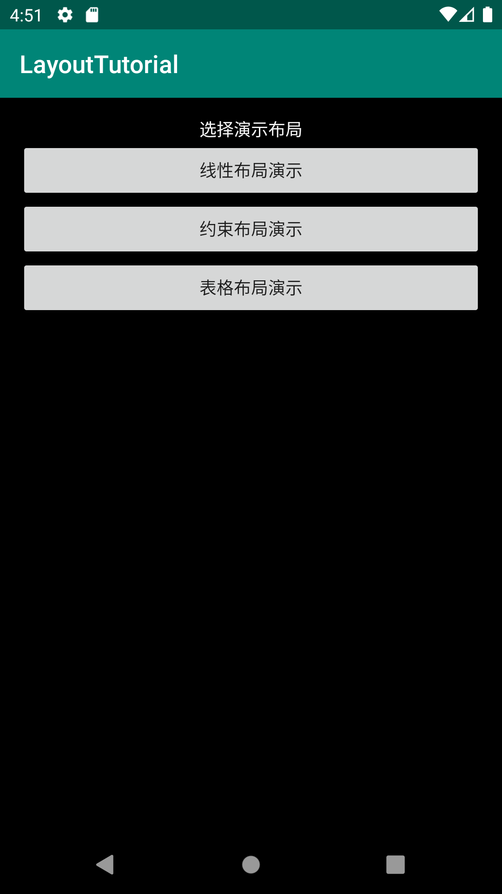
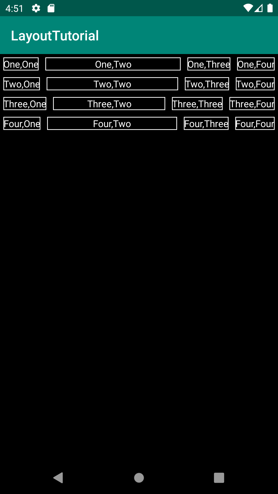
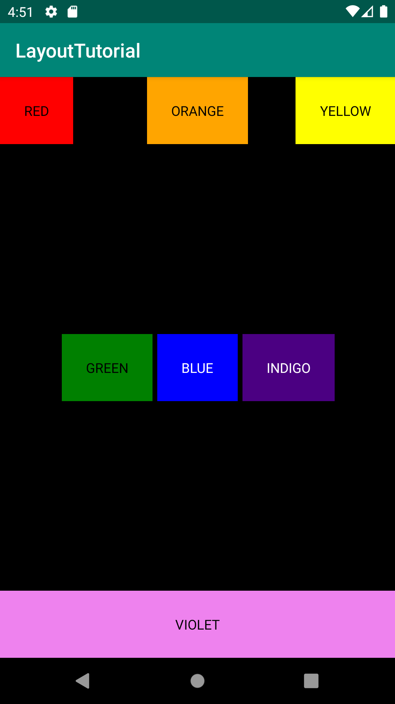
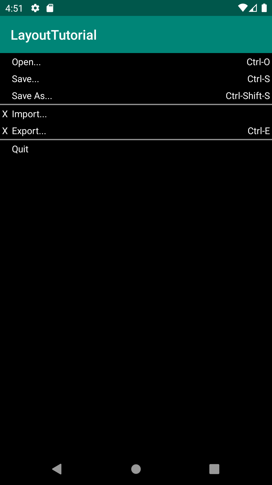

# Android布局实验

#### 1. 初始化界面

首先是初始化界面，添加几个按钮跳转到不同的界面布局示例  

###### 

添加按钮点击事件，点击跳转页面

```java
public void onClick(View view) {
    setContentView(R.layout.linear_layout);
}
```

#### 2. 线性布局页面

###### 

这里线性布局采用嵌套线性布局的方式进行，以一个垂直线性布局嵌套四个水平线性布局。

白色边界的设定，drawable中新建xml文件：

```xml
<?xml version="1.0" encoding="utf-8"?>
<shape xmlns:android="http://schemas.android.com/apk/res/android" android:shape="rectangle" >
    <solid android:color="@color/black" />
    <stroke android:width="1dip" android:color="@color/gray"/>
</shape>
```

layout中使用，添加边界：

```
android:background="@drawable/textview_border"
```

#### 3. 约束布局页面

###### 

注意使用gravity以及layout_constraintRight_toRightOf等属性来控制控件在界面中的显示。

实现文字居中和按钮位置。

#### 4. 表格布局

###### 

注意：

使用View组件并设置其背景色来显示中间的分割线。

```xml
<View
    android:layout_height="2dp"
    android:background="#FF909090"
    android:textColor="@color/gray"/>
```

第二列拉伸：

```xml
android:stretchColumns="1"
```

字符串写在strings.xml；

颜色写在colors.xml；

距离写在dimens.xml。