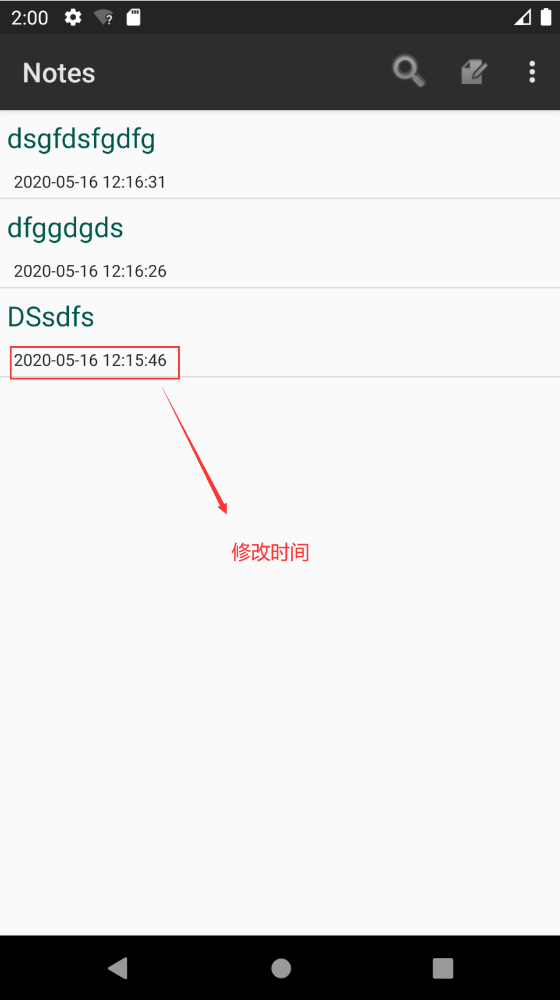
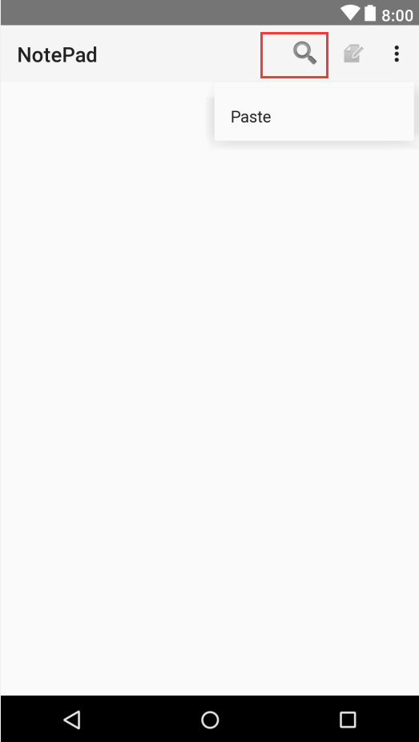
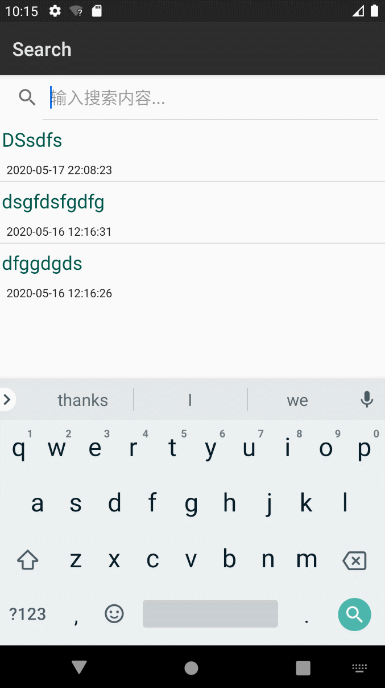
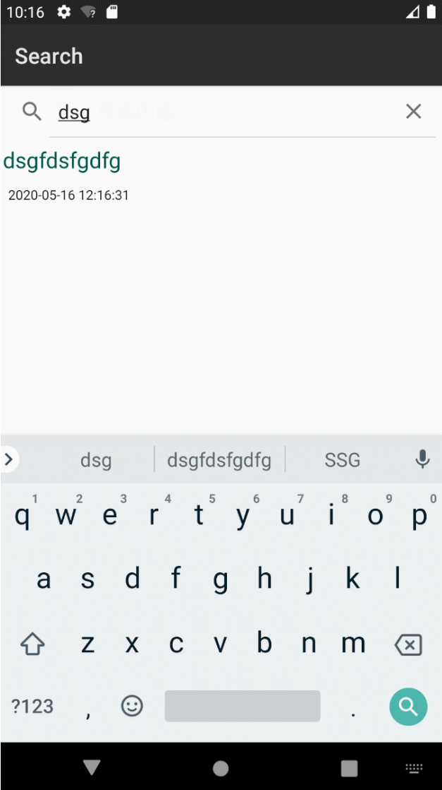

# NotePad笔记本应用

基于Notepad做功能拓展：

基本要求：

**1.NoteList中显示条目增加时间戳显示**
**2.添加笔记查询功能（根据标题查询）**

---

## 时间戳

**（1）在布局文件中增加一个TextView来显示时间戳**

​		textAppearance字体大小的一些参数设置：

- ?android:attr/textAppearanceLarge
- ?android:attr/textAppearanceMedium
- ?android:attr/textAppearanceSmall
  对应的字体大小分别为：18dp,16dp,14dp

```xml
<!--添加一个垂直的线性布局-->
<TextView
    android:id="@+id/text1"
    android:layout_width="match_parent"
    android:layout_height="40dp"
    android:textAppearance="?android:attr/textAppearanceLarge"
    android:gravity="center_vertical"
    android:paddingLeft="5dip"
    android:textColor="@color/colorPrimaryDark"
    android:singleLine="true"
    android:textSize="20sp"
    />

<!--添加显示时间的TextView-->
<TextView
    android:id="@+id/text2"
    android:layout_width="match_parent"
    android:layout_height="match_parent"
    android:textAppearance="?android:attr/textAppearanceLarge"
    android:textSize="12dp"
    android:gravity="center_vertical"
    android:paddingLeft="10dip"
    android:singleLine="true"
    android:layout_weight="1"
    android:layout_margin="0dp"
    />
```


**（2）数据库中已有文本创建时间和修改时间连个字段，在NodeEditor.java中，找到updateNode()这个函数，选取修改时间这一字段，并将其格式化存入数据库**

```java
Date nowTime = new Date(System.currentTimeMillis());
//日期格式化
SimpleDateFormat sdFormatter = new SimpleDateFormat("yyyy-MM-dd HH:mm:ss");

//代码中的retStrFormatNowDate即为转化后的时间格式，
//将其用ContentValues的put方法存入数据库。
String retStrFormatNowDate = sdFormatter.format(nowTime);
values.put(NotePad.Notes.COLUMN_NAME_MODIFICATION_DATE, retStrFormatNowDate);
```


**（3）在NoteList.java的PROJECTION数组中增加该字段的描述，并在SimpleCursorAdapter中的参数viewsIDs和dataColumns增加子段描述，以达到将其读出和显示的目的**

```java
private static final String[] PROJECTION = new String[] {
        NotePad.Notes._ID, // 0
        NotePad.Notes.COLUMN_NAME_TITLE, // 1
        NotePad.Notes.COLUMN_NAME_MODIFICATION_DATE,//修改时间
};
```


**（4）装配的时候需要装配相应的日期，所以dataColumns,viewIDs这两个参数需要加入时间**

SimpleCursorAdapter前加入：

这里的 R.id.text1,R.id.text2 分别对应的是布局文件中两个textview的id

```java
String[] dataColumns = { NotePad.Notes.COLUMN_NAME_TITLE,NotePad.Notes.COLUMN_NAME_MODIFICATION_DATE} ;

/**
 * 这里的 R.id.text1, R.id.text2 分别对应的是布局文件中两个textview的id
 * 而且顺序要一致。
 */
int[] viewIDs = {R.id.text1, R.id.text2};

// Creates the backing adapter for the ListView.
SimpleCursorAdapter  adapter
	= new SimpleCursorAdapter (
    this,                             // The Context for the ListView
    R.layout.noteslist_item,          // Points to the XML for a list item
    cursor,                           // The cursor to get items from
    dataColumns,
    viewIDs
    );
```

**效果如下：**

###### 

**注意：**

如果使用的是安卓模拟器，

为了保持时间一致，要记得修改时区，选择东八区：

###### 

## 按标题搜索

为了使我们可以实现搜索功能，需要一个搜索框，

那么先给菜单栏，增加一个图标，点击，来到搜索页面。

**（1）找到菜单的list_options_menu.xml文件，添加一个搜索的item**

```xml
<item
 android:id="@+id/menu_search"
 android:title="Search"
 android:icon="@android:drawable/ic_search_category_default"
 android:showAsAction="always"
 />
```

菜单效果如下：

###### 

**（2）在NotesList中找到onOptionsItemSelected方法，在switch中添加搜索的case语句**

```java
    case R.id.context_open:
        // Launch activity to view/edit the currently selected item
        startActivity(new Intent(Intent.ACTION_SEARCH,getIntent().getData()));
        return true;
```

**（3）新建一个名为NoteSearch的activity用来显示跳转的搜索界面的内容和功能。在安卓中有个用于搜索控件：SearchView，可以把SearchView跟ListView相结合，动态地显示搜索结果。**

NoteSearch.java文件的布局文件note_search_list.xml

```xml
<?xml version="1.0" encoding="utf-8"?>
<LinearLayout xmlns:android="http://schemas.android.com/apk/res/android"
    android:orientation="vertical" android:layout_width="match_parent"
    android:layout_height="match_parent">

    <SearchView
        android:id="@+id/search_view"
        android:layout_width="match_parent"
        android:layout_height="wrap_content"
        android:iconifiedByDefault="false"
        android:queryHint="输入搜索内容..."
        android:layout_alignParentTop="true">
    </SearchView>

    <ListView
        android:id="@android:id/list"
        android:layout_width="match_parent"
        android:layout_height="wrap_content">
    </ListView>

</LinearLayout>
```

NoteSearch.java

```java
package com.example.android.notepad;

import android.app.ListActivity;
import android.content.ContentUris;
import android.content.Intent;
import android.database.Cursor;
import android.net.Uri;
import android.os.Bundle;
import android.view.View;
import android.widget.ListView;
import android.widget.SearchView;
import android.widget.SimpleCursorAdapter;

public class NoteSearch extends ListActivity implements SearchView.OnQueryTextListener {

    private static final String[] PROJECTION = new String[]{
            NotePad.Notes._ID, // 0
            NotePad.Notes.COLUMN_NAME_TITLE, // 1
            NotePad.Notes.COLUMN_NAME_MODIFICATION_DATE, // 时间
            // NotePad.Notes.COLUMN_NAME_BACK_COLOR //颜色
    };

    @Override
    protected void onCreate(Bundle savedInstanceState) {
        super.onCreate(savedInstanceState);
        setContentView(R.layout.note_search_list);
        Intent intent = getIntent();
        if (intent.getData() == null) {
            intent.setData(NotePad.Notes.CONTENT_URI);
        }
        SearchView searchview = (SearchView) findViewById(R.id.search_view);
        searchview.setOnQueryTextListener(NoteSearch.this);  //为查询文本框注册监听器
    }

    @Override
    public boolean onQueryTextSubmit(String query) {
        return false;
    }

    @Override
    public boolean onQueryTextChange(String s) { //Test改变的时候执行的内容
        //Text发生改变时执行的内容
        String selection = NotePad.Notes.COLUMN_NAME_TITLE + " Like ? ";//查询条件
        String[] selectionArgs = {"%" + s + "%"};//查询条件参数，配合selection参数使用,%通配多个字符

        //查询数据库中的内容,当我们使用 SQLiteDatabase.query()方法时，就会得到Cursor对象， Cursor所指向的就是每一条数据。
        //managedQuery(Uri, String[], String, String[], String)等同于Context.getContentResolver().query()
        Cursor cursor = managedQuery(
                getIntent().getData(),            // Use the default content URI for the provider.用于ContentProvider查询的URI，从这个URI获取数据
                PROJECTION,                       // Return the note ID and title for each note. and modifcation date.用于标识uri中有哪些columns需要包含在返回的Cursor对象中
                selection,                        // 作为查询的过滤参数，也就是过滤出符合selection的数据，类似于SQL的Where语句之后的条件选择
                selectionArgs,                    // 查询条件参数，配合selection参数使用
                NotePad.Notes.DEFAULT_SORT_ORDER  // Use the default sort order.查询结果的排序方式，按照某个columns来排序，例：String sortOrder = NotePad.Notes.COLUMN_NAME_TITLE
        );

        //一个简单的适配器，将游标中的数据映射到布局文件中的TextView控件或者ImageView控件中
        String[] dataColumns = {NotePad.Notes.COLUMN_NAME_TITLE, NotePad.Notes.COLUMN_NAME_MODIFICATION_DATE};
        int[] viewIDs = {R.id.text1, R.id.text2};
        SimpleCursorAdapter adapter = new SimpleCursorAdapter(
                this,                   //context:上下文
                R.layout.noteslist_item,         //layout:布局文件，至少有int[]的所有视图
                cursor,                          //cursor：游标
                dataColumns,                     //from：绑定到视图的数据
                viewIDs                          //to:用来展示from数组中数据的视图
                //flags：用来确定适配器行为的标志，Android3.0之后淘汰
        );
        setListAdapter(adapter);
        return true;
    }

    @Override
    protected void onListItemClick(ListView l, View v, int position, long id) {

        // Constructs a new URI from the incoming URI and the row ID
        Uri uri = ContentUris.withAppendedId(getIntent().getData(), id);

        // Gets the action from the incoming Intent
        String action = getIntent().getAction();

        // Handles requests for note data
        if (Intent.ACTION_PICK.equals(action) || Intent.ACTION_GET_CONTENT.equals(action)) {

            // Sets the result to return to the component that called this Activity. The
            // result contains the new URI
            setResult(RESULT_OK, new Intent().setData(uri));
        } else {

            // Sends out an Intent to start an Activity that can handle ACTION_EDIT. The
            // Intent's data is the note ID URI. The effect is to call NoteEdit.
            startActivity(new Intent(Intent.ACTION_EDIT, uri));
        }
    }
}
```

**（1）最后要在AndroidManifest.xml注册NoteSearch：**

```xml
        <activity
            android:name="NoteSearch"
            android:label="Search">
            <intent-filter>
                <action android:name="android.intent.action.NoteSearch" />
                <action android:name="android.intent.action.SEARCH" />
                <action android:name="android.intent.action.SEARCH_LONG_PRESS" />
                <category android:name="android.intent.category.DEFAULT" />
                <data android:mimeType="vnd.android.cursor.dir/vnd.google.note" />
                <!--1.vnd.android.cursor.dir代表返回结果为多列数据-->
                <!--2.vnd.android.cursor.item 代表返回结果为单列数据-->
            </intent-filter>
        </activity>
```

**效果如下：**

动态：

###### 

静态：

###### 


