# Android UI组件
## 导航页面

用于跳转到以下四个实验

1. Android ListView的用法

2. 创建自定义布局的AlertDialog

3. 使用XML定义菜单

4. 创建上下文操作模式(ActionMode)的上下文菜单

###### 

## 实验一：ListView的用法
使用SimpleAdapter用来装配ListView。ListView每个Item包含一个ImageView和一个TextView。

**定义一个ListView**

listSelector来实现单击选中后显示颜色

```xml
    <ListView
        android:id="@+id/ListView"
        android:layout_width="match_parent"
        android:layout_height="wrap_content"
        android:dividerHeight="1dp"
        android:listSelector="#9EEAF3"/>
```

**定义一个ImageView和一个TextView**

ListView每个Item包含一个ImageView和一个TextView。Adapter装配的时候要用到。

```xml
       <TextView
            android:id="@+id/textView"
            android:layout_width="wrap_content"
            android:layout_height="wrap_content"
            android:layout_weight="1"
            android:paddingLeft="10dp"
            android:textSize="20sp" />

        <ImageView
            android:id="@+id/imageView"
            android:layout_width="50dp"
            android:layout_height="50dp"
            android:paddingRight="10dp" />
```

**Activity文件**

**1.定义hashmap存放资源**

包括头像、姓名。

```java
ArrayList<HashMap<String,String>> arrayList=new ArrayList<>();
for (int i=0;i<animalName.length;i++)
{
    HashMap<String,String> hashMap=new HashMap<>();
    hashMap.put("name",animalName[i]);
    hashMap.put("image",animalImages[i]+"");
    arrayList.add(hashMap);
}
```

**2.为ListView绑定adapter**

注意顺序，要和每层内容的类型相对，他会根据key的顺序，指定放入。

```java
SimpleAdapter simpleAdapter = new SimpleAdapter(this, arrayList,
                R.layout.list_view_items, new String[]{"name", "image"},
                new int[]{R.id.name, R.id.header});
        ListView simpleListView = findViewById(R.id.ListView);
        simpleListView.setAdapter(simpleAdapter);
```

**3.为ListView设置监听事件**

点击item时，根据item的positon弹出toast，显示不同的item内容。

```java
//单击事件
simpleListView.setOnItemClickListener(new AdapterView.OnItemClickListener() {
    @Override
    public void onItemClick(AdapterView<?> adapterView, View view, int i, long l) {
        Toast.makeText(getApplicationContext(),animalName[i],Toast.LENGTH_LONG).show();
    }
});
```

效果如下：

###### 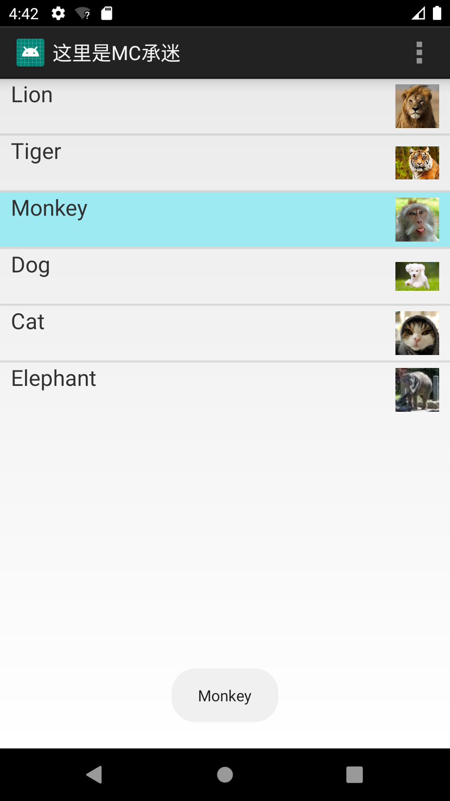


## 实验二：创建自定义布局的AlertDialog

实验步骤:
1、创建AlertDialog. Builder对象。
2、调用Builder对象的setTitle方法设置标题，setIcon方法设置图标。
3、调用Builder相关方法设置不同类型的对话框内容。
4、调用setPositiveButton、 setNegativeButton、 setNeutralButton设置多个按钮。
5、调用Builder对象的create()方法创建AlertDialog对象。
6、调用AlertDialog对象的show()方法将对话框显示出来。

```xml
<?xml version="1.0" encoding="utf-8"?>
<LinearLayout xmlns:android="http://schemas.android.com/apk/res/android"
    android:orientation="vertical"
    android:layout_width="wrap_content"
    android:layout_height="wrap_content">

    <!-- 标题栏 -->
    <ImageView
        android:src="@drawable/header_logo"
        android:layout_width="match_parent"
        android:layout_height="64dp"
        android:scaleType="center"
        android:background="#FFFFBB33"
        android:contentDescription="@string/app_name" />

    <!-- 输入用户名的文本框 -->
    <EditText
        android:id="@+id/username"
        android:inputType="textEmailAddress"
        android:layout_width="match_parent"
        android:layout_height="wrap_content"
        android:layout_marginTop="16dp"
        android:layout_marginLeft="4dp"
        android:layout_marginRight="4dp"
        android:layout_marginBottom="4dp"
        android:hint="@string/username" />
    
    <!-- 输入密码的文本框 -->
    <EditText
        android:id="@+id/password"
        android:inputType="textPassword"
        android:layout_width="match_parent"
        android:layout_height="wrap_content"
        android:layout_marginTop="4dp"
        android:layout_marginLeft="4dp"
        android:layout_marginRight="4dp"
        android:layout_marginBottom="16dp"
        android:fontFamily="sans-serif"
        android:hint="@string/password"/>
</LinearLayout>
```

dialog的布局样式：

###### 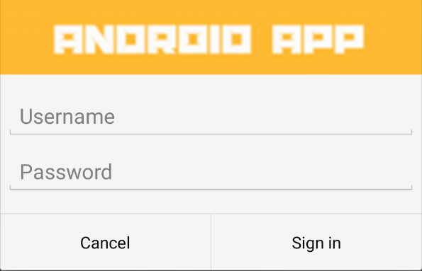

定义一个主页面，含有一个按钮，点击，弹出dialog

```xml
<?xml version="1.0" encoding="utf-8"?>
<RelativeLayout xmlns:android="http://schemas.android.com/apk/res/android"
    android:layout_width="match_parent"
    android:layout_height="match_parent">
    <Button
        android:layout_width="wrap_content"
        android:layout_height="wrap_content"
        android:width="200dp"
        android:height="100dp"
        android:textSize="12pt"
        android:layout_centerHorizontal="true"
        android:layout_centerVertical="true"
        android:id="@+id/custom_dialog_btn"
        android:text="@string/custom_dialog_tutorial"/>
</RelativeLayout>
```

CustomDialog实现类：

给按钮添加了**响应事件**，

点击**弹出登录框**，输入账号密码。

再给对话框的**消极按钮**和**积极按钮**分别添加响应事件：

**点击消极按钮**：**弹出toast**，内容为 “cancel" 。

点击**积极按钮**，登录成功，我这里写的是**跳转到第三题的页面**，同时**弹出一个toast**，显示的内容为 ”Login Success“。

```java
package com.fjnu.lcr.uicomponent;

import android.app.Activity;
import android.app.AlertDialog;
import android.content.DialogInterface;
import android.content.Intent;
import android.os.Bundle;
import android.view.LayoutInflater;
import android.view.View;
import android.widget.Button;
import android.widget.Toast;

public class CustomDialog extends Activity {


    @Override
    protected void onCreate(Bundle savedInstanceState) {
        super.onCreate(savedInstanceState);
        setContentView(R.layout.activity_custom_dialog_tutorial);
        Button btn_custom_dialog = (Button)findViewById(R.id.custom_dialog_btn);
        btn_custom_dialog.setOnClickListener(new View.OnClickListener() {
            @Override
            public void onClick(View view) {
                createDialog();
            }
        });
    }

    public void createDialog() {
        AlertDialog.Builder builder = new AlertDialog.Builder(this);
        LayoutInflater inflater = getLayoutInflater();

        builder.setView(inflater.inflate(R.layout.custom_dialog, null))

                .setPositiveButton(R.string.signin, new DialogInterface.OnClickListener() {
                    @Override
                    public void onClick(DialogInterface dialog, int id) {
                        Intent intent = new Intent(CustomDialog.this, XmlDefineMenuTutorial.class);
                        startActivity(intent);
                        Toast.makeText(getApplicationContext(),"Login Success",Toast.LENGTH_LONG).show();
                    }
                })
                .setNegativeButton(R.string.cancel, new DialogInterface.OnClickListener() {
                    public void onClick(DialogInterface dialog, int id) {
                        Toast.makeText(getApplicationContext(),"Cancel",Toast.LENGTH_LONG).show();
                    }
                });
        builder.create();
        builder.show();
    }

}
```

效果如下：

###### 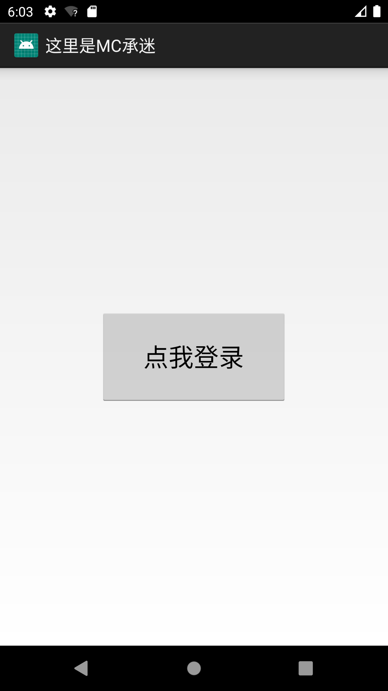

点击后：

###### 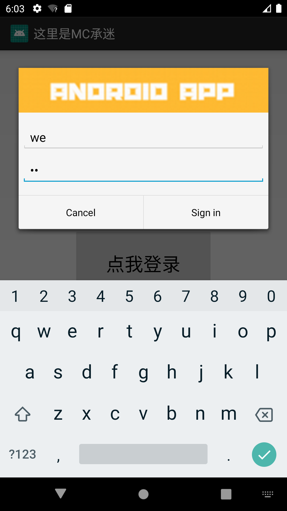

点击取消，弹出toast

###### 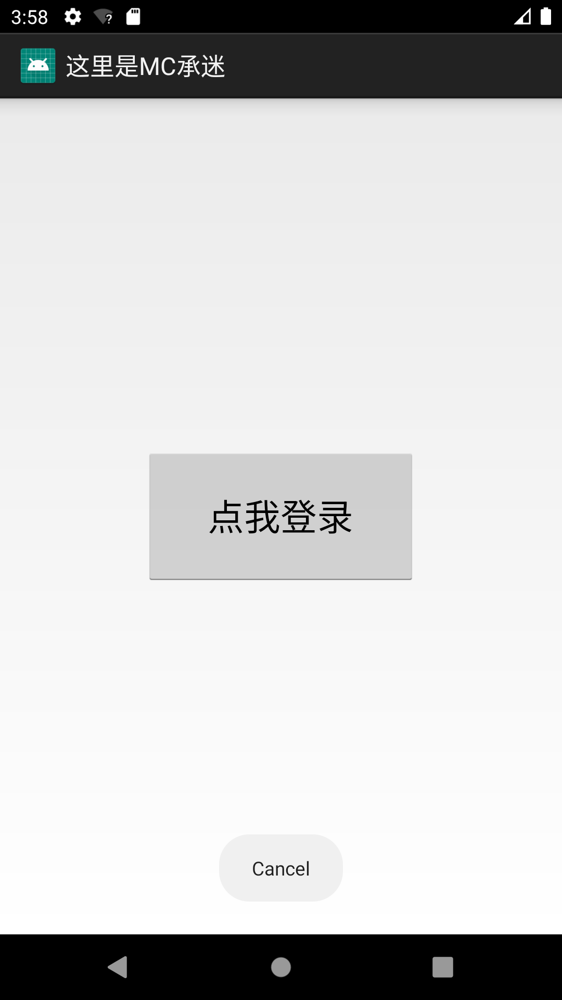

点击登录，跳转到第三题的页面，并弹出登录成功toast。

###### 

登录动态演示：

###### 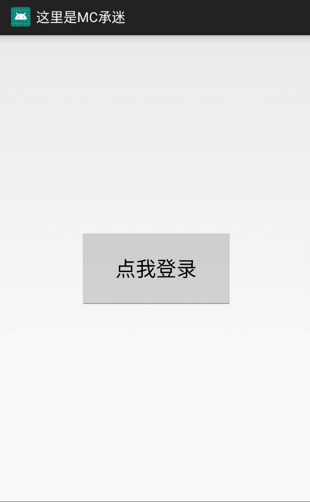


## 实验三：使用XML定义菜单

1.重写onOptionsItemSelected就可以实现optionmenu，

2.配合onCreateOptionsMenu就可以实现点击的功能响应。

定义xml文件：

```xml
<menu xmlns:android="http://schemas.android.com/apk/res/android">
    <item android:title="@string/menu_Font">
        <menu>
            <item
                android:id="@+id/menu_font_small"
                android:title="@string/menu_font_small"/>
            <item
                android:id="@+id/menu_font_middle"
                android:title="@string/menu_font_middle"/>
            <item
                android:id="@+id/menu_font_big"
                android:title="@string/menu_font_big"/>
        </menu>

    </item>
    <item
        android:id="@+id/menu_normal"
        android:title="@string/menu_Normal">
    </item>
    <item android:title="@string/menu_Color">
        <menu>
            <item
                android:id="@+id/menu_color_red"
                android:title="@string/menu_color_red" />
            <item
                android:id="@+id/menu_color_black"
                android:title="@string/menu_color_black"/>
        </menu>
    </item>
</menu>
```

重写回调方法：

```java
public boolean onOptionsItemSelected(MenuItem item) {
        switch (item.getItemId()) {
            case R.id.menu_font_small:
                tv_test.setTextSize(10*2);
                break;
            case R.id.menu_font_middle:
                tv_test.setTextSize(16*2);
                break;
            case R.id.menu_font_big:
                tv_test.setTextSize(20*2);
                break;
            case R.id.menu_normal:
                Toast.makeText(XmlDefineMenuTutorial.this, "这是普通菜单项", Toast.LENGTH_SHORT).show();
                break;
            case R.id.menu_color_red:
                tv_test.setTextColor(Color.RED);
                break;
            case R.id.menu_color_black:
                tv_test.setTextColor(Color.BLACK);
                break;
        }
        return true;
    }
```

配合oncreate使用：

```java
    @Override
    protected void onCreate(Bundle savedInstanceState) {
        super.onCreate(savedInstanceState);
        setContentView(R.layout.activity_xml_define_menu_tutorial);
        tv_test = (TextView) findViewById(R.id.tv_test);
    }
```

###### 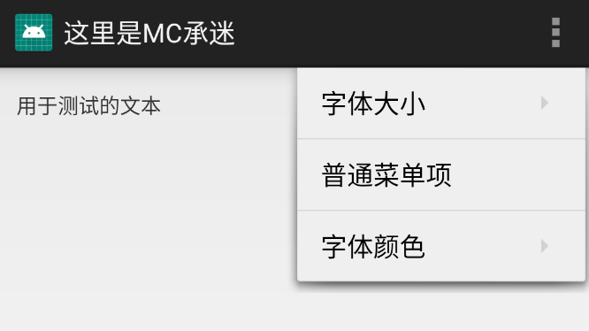

###### 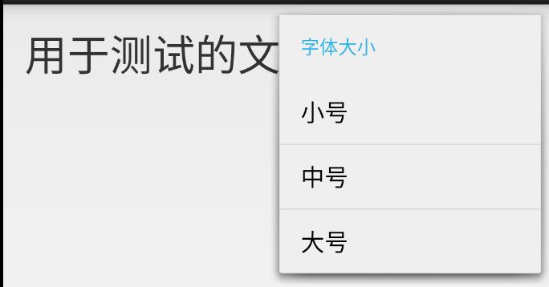

###### 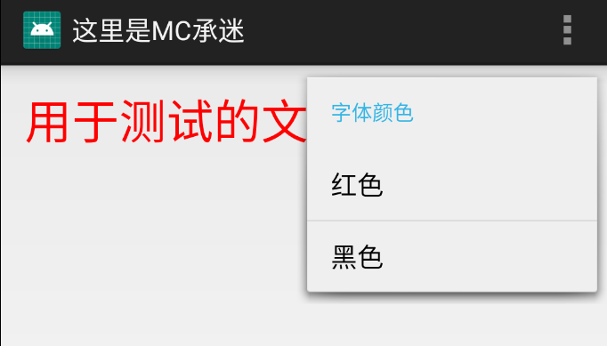

###### 


## 实验四：创建ActionMode模式的上下文菜单

上下文操作模式是Android3.0以后添加新特性，是上下文菜单的首选模式。

应用如何调用上下文操作模式以及如何定义每个操作的行为，具体取决于您的设计。 设计基本上分为两种：


- 针对单个任意视图的上下文操作。
- 针对 ListView 或 GridView 中项目组的批处理上下文操作（允许用户选择多个项目并针对所有项目执行操作）。

这里演示在 ListView 或 GridView 中启用批处理上下文操作

如果在 ListView 或 GridView 中有一组项目（或 AbsListView 的其他扩展），且需要允许用户执行批处理操作，则

应：

- 实现 AbsListView.MultiChoiceModeListener 接口，并使用 setMultiChoiceModeListener() 为视图组设置该接口。在侦听器的回调方法中，您既可以为上下文操作栏指定操作，也可以响应操作项目的点击事件，还可以处理从 ActionMode.Callback 接口继承的其他回调。
- 使用 CHOICE_MODE_MULTIPLE_MODAL 参数调用 setChoiceMode()。

**成员函数有：**

onItemCheckedStateChanged（响应列表每行点击或者状态改变）、onActionItemClicked（响应顶部菜单栏的点击事件）、onCreateActionMode（创建时初始化，只执行一次）、onPrepareActionMode（每次使用时调用）、onDestroyActionMode（清理）

**一些语句：**

使菜单项一直显示在ActionBar上

```xml
app:showAsAction="always"
```

设置多选模式

```
list.setChoiceMode(ListView.CHOICE_MODE_MULTIPLE_MODAL);
```

**关键代码：**

```java
        listView.setChoiceMode(ListView.CHOICE_MODE_MULTIPLE_MODAL);
        listView.setMultiChoiceModeListener(new AbsListView.MultiChoiceModeListener() {

             /*
             * 可在此方法中监听标题栏Menu的监听，从而进行相应操作
             * 设置actionMode菜单每个按钮的点击事件
             */
            @Override
            public boolean onActionItemClicked(ActionMode mode, MenuItem item) {
                switch (item.getItemId()) {
                    case R.id.menu_delete:
                        num = 0;
                        mode.finish(); 
                        return true;
                    case R.id.menu_select:
                        num = names.length;
                        selectAll();
                        adapter.notifyDataSetChanged();
                    default:
                        return false;
                }
            }

             /*
             * 参数：ActionMode是长按后出现的标题栏
             * 		positon是当前选中的item的序号
             *		id 是当前选中的item的id
             *		checked 如果是选中事件则为true，如果是取消事件则为false
             */
              @Override
            public void onItemCheckedStateChanged(ActionMode mode, int position,
                                                  long id, boolean checked) {
                if (checked == true) {
                    listItem.get(position).setState(true);
                    adapter.notifyDataSetChanged();
                    num++;
                } else {
                    listItem.get(position).setState(false);
                    adapter.notifyDataSetChanged();
                    num--;
                }
                mode.setTitle("  " + num + " Selected");
            }
            
            public void selectAll() {
                for(int i = 0; i < names.length; i++){
                    listItem.get(i).setState(true);
                }
            }
            
            /*
             * 参数：ActionMode是长按后出现的标题栏
             * 		Menu是标题栏的菜单内容
             */
            @Override
            public boolean onCreateActionMode(ActionMode mode, Menu menu) {
                MenuInflater inflater = mode.getMenuInflater();
                inflater.inflate(R.menu.activity_action_mode, menu);
                return true;
            }

            /*
             * 可在此方法中进行标题栏UI的创建和更新
             */
            @Override
            public boolean onPrepareActionMode(ActionMode mode, Menu menu) {
                refresh();
                adapter.notifyDataSetChanged();
                return false;
            }
            
             @Override
            public void onDestroyActionMode(ActionMode mode) {
                refresh();
                adapter.notifyDataSetChanged();
            }

            public void refresh() {
                for(int i = 0; i < names.length; i++){
                    listItem.get(i).setState(false);
                }
            }
            
        });
```

为了达到取消选择的效果：

**需要重写adapter**

创建一个hashmap用于记录是否选中，与action mode的onItemCheckedStateChanged方法搭配使用。就可以获取item状态，从而进行删除等操作。

```java
private class SelectionAdapter extends ArrayAdapter<String> {

        private HashMap<Integer, Boolean> mSelection = new HashMap<Integer, Boolean>();

        public SelectionAdapter(Context context, int resource,
                                int textViewResourceId, String[] objects) {
            super(context, resource, textViewResourceId, objects);
        }

        public void setNewSelection(int position, boolean value) {
            mSelection.put(position, value);
            notifyDataSetChanged();
        }

        public boolean isPositionChecked(int position) {
            Boolean result = mSelection.get(position);
            return result == null ? false : result;
        }

        public Set<Integer> getCurrentCheckedPosition() {
            return mSelection.keySet();
        }

        public void removeSelection(int position) {
            mSelection.remove(position);
            notifyDataSetChanged();
        }

        public void clearSelection() {
            mSelection = new HashMap<Integer, Boolean>();
            notifyDataSetChanged();
        }

        @Override
        public View getView(int position, View convertView, ViewGroup parent) {
            View v = super.getView(position, convertView, parent);
            v.setBackgroundColor(getResources().getColor(android.R.color.background_light)); 

            if (mSelection.get(position) != null) {
                v.setBackgroundColor(getResources().getColor(android.R.color.holo_blue_light));
            }
            return v;
        }
    }
```


**演示结果：**

初始：

###### 

长按列表项：

###### 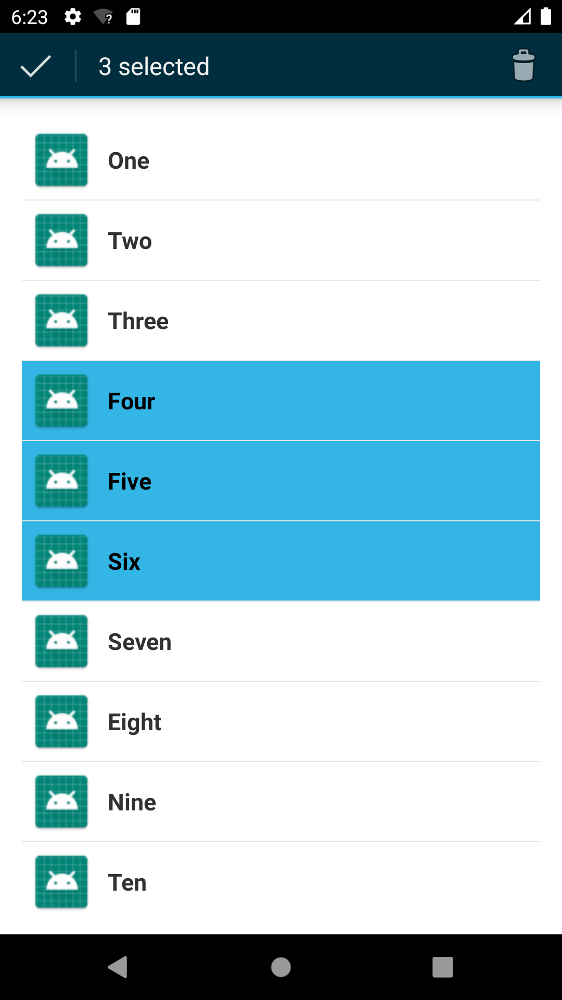

点击垃圾桶取消：

###### 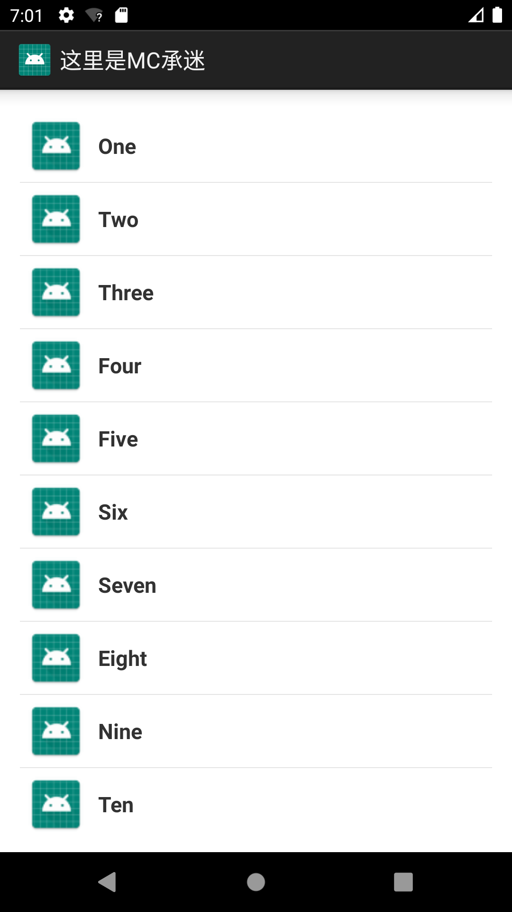


**动态演示：**

###### 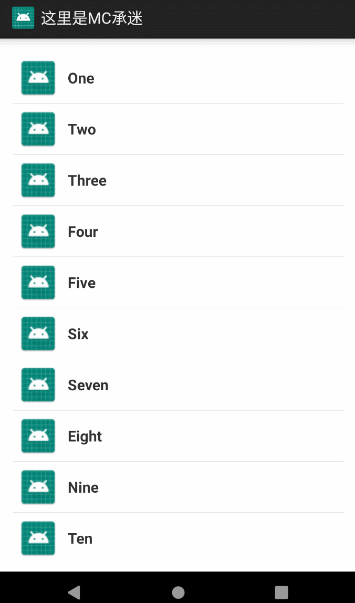